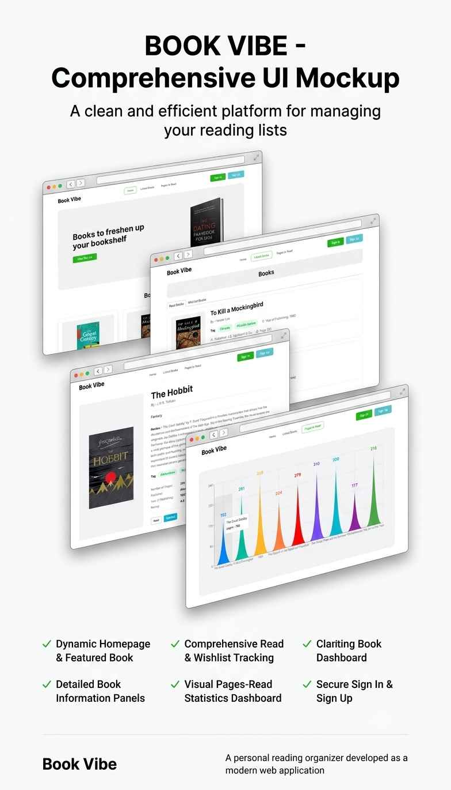

# 📚 Book Vibe

Book Vibe is a modern web application built for book lovers to explore, discover, and manage books in a simple and interactive way. It offers a clean UI, smooth browsing experience, detailed book pages, and a personal reading/wishlist tracker — all wrapped in a fast, responsive interface.

**🔗 Live Demo:** [https://book-vibe-indol-two.vercel.app/](https://book-vibe-indol-two.vercel.app/)

---

## 🚀 Features

- 📖 Browse a curated collection of books on the home page
- 🏷️ Genre tags and star ratings on every book card
- 🔍 Dedicated **Listed Books** page with **Read Books** and **Wishlist Books** tabs
- 📄 Detailed book view — cover, review, tags, page count, publisher, publish year, and rating
- ➕ **Read** and **Wishlist** actions directly from the book details page
- 📊 **Pages to Read** — an interactive chart visualizing page counts across your book list, with hover tooltips
- 📱 Fully responsive design (mobile + desktop)
- ⚡ Fast, lightweight UI powered by Vite

---

## 🛠️ Tech Stack

| Category         | Technology                          |
|-------------------|--------------------------------------|
| Frontend          | React.js                            |
| Build Tool        | Vite                                 |
| Styling           | Tailwind CSS / DaisyUI               |
| Routing           | React Router                         |
| State Management  | React Context API                    |
| Data Visualization| Chart library (Recharts / Chart.js)  |
| Data Source       | Local JSON (`booksData.json`)        |
| Code Quality      | ESLint + Prettier                    |
| Deployment        | Vercel                               |

---

## 📂 Project Structure

```
Book-Vibe/
│
├── public/
│   └── booksData.json          # Book dataset
│
├── src/
│   ├── assets/                 # Images, icons, static assets
│   ├── component/
│   │   ├── HomePage/
│   │   └── ListedBooks/
│   │       ├── ListedReadBooks/
│   │       └── ListedWishlistBooks/
│   ├── Context/                # Global state (Context API)
│   ├── layout/                 # Shared layout wrapper
│   ├── shared/
│   │   └── navbar/
│   │       └── Navbar.jsx
│   ├── pages/
│   │   ├── Book Details/
│   │   ├── Books/
│   │   ├── error/
│   │   ├── HomPage/
│   │   └── Page To Read/
│   ├── routes/                 # App route definitions
│   ├── index.css
│   └── main.jsx
│
├── index.html
├── package.json
├── vite.config.js
├── eslint.config.js
└── README.md
```

---

## ⚙️ Installation & Setup

Follow these steps to run the project locally:

```bash
# Clone the repository
git clone https://github.com/your-username/book-vibe.git

# Go to project folder
cd book-vibe

# Install dependencies
npm install

# Start development server
npm run dev
```

The app will be available at `http://localhost:5173` by default.

---

## 🌐 Live Demo

🔗 [https://book-vibe-indol-two.vercel.app/](https://book-vibe-indol-two.vercel.app/)

---

## 📸 Screenshots



---

## 🎯 Future Improvements

- [ ] User authentication (login/signup)
- [ ] Backend integration with a real database
- [ ] Book reviews & ratings submitted by users
- [ ] Dark mode support
- [ ] Advanced search and filtering system

---

## 🤝 Contributing

Contributions are welcome! If you'd like to improve this project:

1. Fork the repo
2. Create a new branch (`git checkout -b feature/your-feature`)
3. Make your changes
4. Commit (`git commit -m "Add your feature"`)
5. Push (`git push origin feature/your-feature`)
6. Submit a pull request

---

## 📄 License

This project is open source and available under the [MIT License](LICENSE).